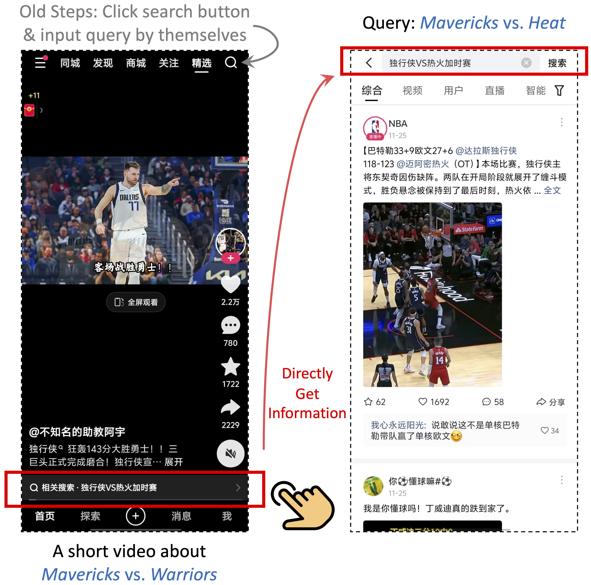

# KuaiRS

*KuaiRS* is a large-scale and real-world dataset for I2Q recommendations in related search collected from the short-video mobile app, [Kuaishou (快手)](https://www.kuaishou.com/en), a leading short-video app in China with over 400 million daily active users.  

## Overview

In the following figure, a query related to the current video is placed at the bottom of the interface. 
Once users' interests are triggered by the query, they can directly click it to enter the search scenario.
In the traditional way, users first click the search button, then manually input the query, and finally get the search results.
Compared the traditional way, this design simplifies the user behavior chain, thereby reducing the users' search cost. 
Additionally, compared to the queries that users come up with themselves, our recommended queries can more accurately describe the content (e.g., some trending topics and memes).
Moreover, it serves as a bridge between recommendation and search, seamlessly transitioning users from recommendation to search, transforming passive interests into active interests. 

## License

[![CC BY-NC 4.0][cc-by-nc-shield]][cc-by-nc]

This work is licensed under a
[Creative Commons Attribution-NonCommercial 4.0 International License][cc-by-nc].

[![CC BY-NC 4.0][cc-by-nc-image]][cc-by-nc]

[cc-by-nc]: http://creativecommons.org/licenses/by-nc/4.0/
[cc-by-nc-image]: https://licensebuttons.net/l/by-nc/4.0/88x31.png
[cc-by-nc-shield]: https://img.shields.io/badge/License-CC%20BY--NC%204.0-lightgrey.svg
